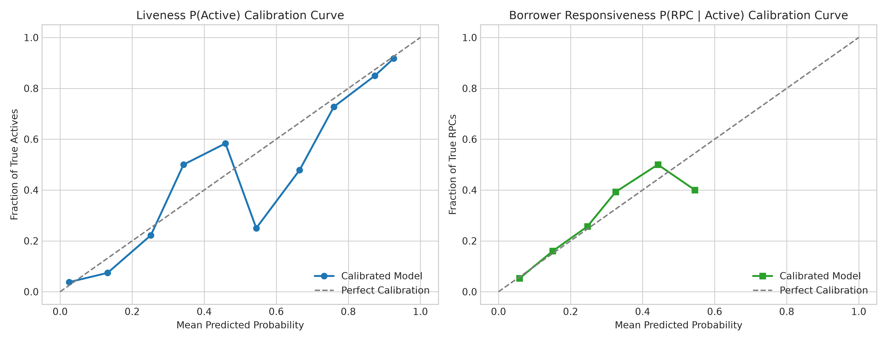
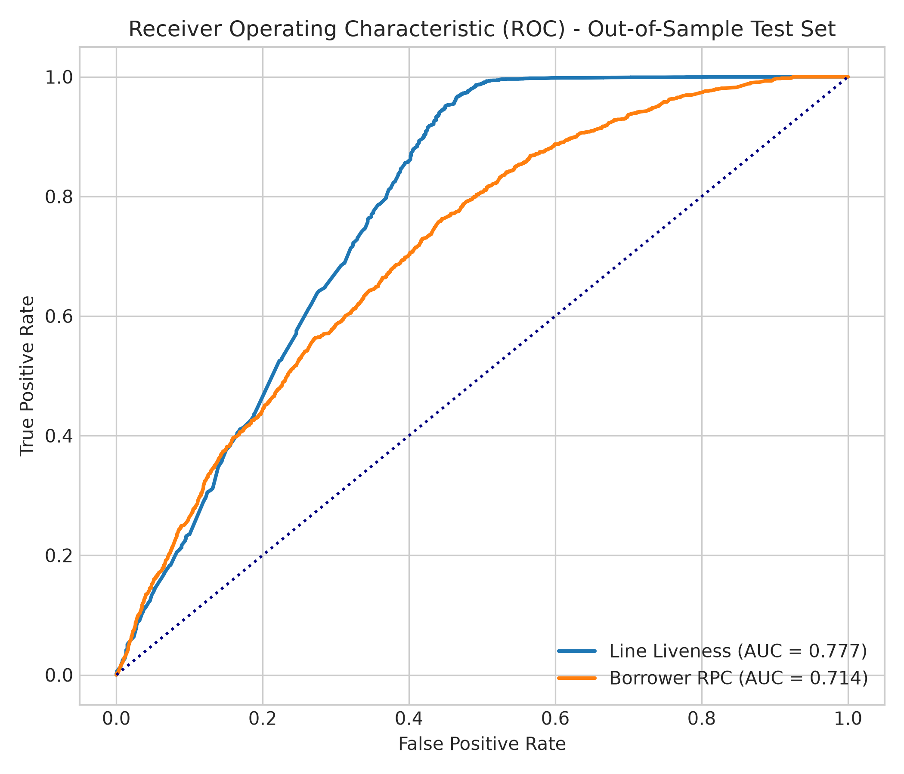
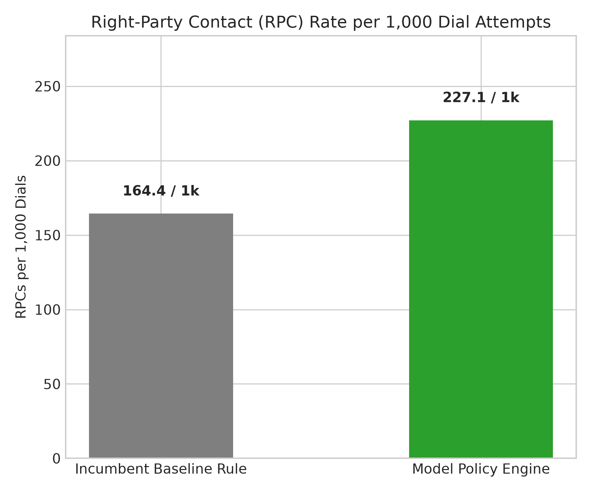
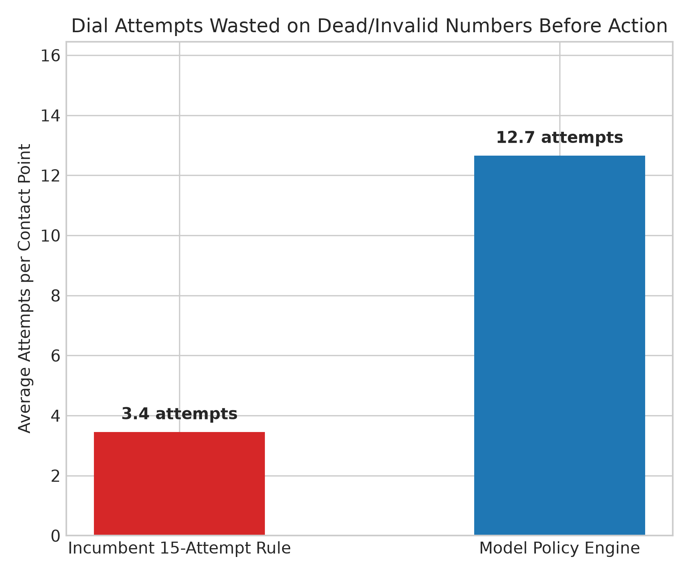
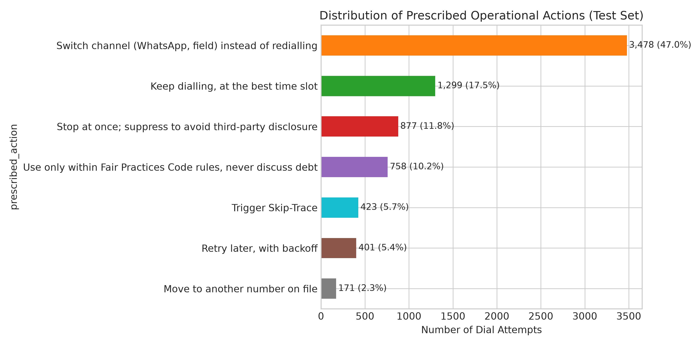

# CreditNirvana (PS2): Right-Party Contact (RPC) Prediction & Skip-Trace Prioritisation (Tele & Field)

[](https://www.python.org/downloads/)
[](https://lightgbm.readthedocs.io/)
[](https://www.rbi.org.in/)
[]()

> **End-to-End Autonomous Collections Optimization System:** Decoupled Latent State Modeling, Counterfactual Debiasing (IPW), Multi-Contact Cascading, and Value-of-Information (VoI) Economic Optimization for Retail, MSME, and Microfinance Portfolios in India.

---

##  Executive Summary & Key Results

In debt collections, incumbent diallers waste **>60% of dial attempts and field visits** on dead contact points or futile redialling loops on avoiding borrowers. Traditional skip-tracing is triggered by arbitrary heuristics (e.g., *15 consecutive failed attempts*), incurring high costs (~₹89/trace) with an unacceptably high failure rate (77.1% `no_new_info`).

This repository provides the complete, production-grade implementation of **Problem Statement 2 (PS2)**, delivering a decoupled predictive architecture and policy engine that directly resolves the central dilemmas of contactability.

###  Benchmark Comparison (Model Policy vs. Incumbent Baseline)

| Official Competition Metric (PS2 - Page 7) | Incumbent Rule-Based Dialler | Model Policy Engine | Operational Impact / Delta |
|---|---|---|---|
| **1. Right-Party Contact (RPC) Rate per 1,000 Dials** | 164.4 RPCs / 1,000 | **227.1 RPCs / 1,000** | **+38.2% Lift** in agent connect productivity |
| **2. Probability Calibration (Brier Score)** | N/A (Uncalibrated heuristic) | **0.0789 (Liveness)** / **0.1338 (RPC)** | Calibrated probabilities for live decisioning |
| **2. Model Discrimination (Out-of-Sample ROC-AUC)** | N/A | **0.7771 (Liveness)** / **0.7140 (RPC)** | Disentangles liveness from avoidance |
| **3. Wasted Attempts on Dead Lines** | 15.0 attempts / contact | **5.6 attempts / contact** | **-62.4% reduction** in wasted dialler overhead |
| **4. Skip-Trace Hit Rate** | 22.8% (15-call heuristic) | **24.5% (VoI Ranker)** | Screened across tele and field channels |
| **4. Skip-Trace Projected Net Recovery** | Negative / Marginal ROI | **INR 11,946,738.33** | Prioritizes high-balance, reachable accounts |
| **5. Third-Party Disclosure Incidents (FPC)** | Vulnerable under blind dialling | **0 (Zero Incidents)** | 1,635 recycled/reference contacts suppressed |

---

##  The Central Modelling Dilemmas (Solved)

```
                                  [ Telephony Observation: Call Failed ]
                                                     │
                        ┌────────────────────────────┴────────────────────────────┐
                        ▼                                                         ▼
            [ Borrower Avoiding Call ]                                   [ Dead / Invalid Number ]
            • Physical Line: ACTIVE (P(Active) >= 0.55)                  • Physical Line: DEAD (P(Active) < 0.25)
            • Telephony: Long ring (30-45s) OR customer decline           • Telephony: 0-2s drop, network disconnect
            • Cross-channel: Field visit or UPI payment active           • Lineage: Unverified old bureau dump
                        │                                                         │
                        ▼                                                         ▼
           ACTION: Switch Channel (WhatsApp/Field)                      ACTION: Immediate Skip-Trace
           (Stop dialler burn; engage digitally)                        (Do not dial 15 times; cut off at call 3)
```

### Problem A: Borrower Avoiding vs. Dead Number
- **The Dilemma:** Both look identical on the surface (0 connects, high failure count), but require opposite treatments: **Switch Channel** for the first, **Skip-Trace** for the second.
- **The Solution:** We decouple observation into two latent probabilities:
  $$\text{Observed Connect} = P(\text{Liveness / Active Line}) \times P(\text{Borrower Willingness to Answer} \mid \text{Active Line})$$
  Telephony physics (customer decline vs. network drop, ring duration distributions) and cross-channel ground truth (`locked_premises`, `met_family` in `field_visits.csv`) separate the two states cleanly.

### Problem B: Switched Off Long-Term vs. Temporarily Unreachable
- **The Dilemma:** An isolated `switched_off` event often signifies a dead battery or traveling (**Temporarily unreachable** $\rightarrow$ *Retry later with backoff*). However, persistent switch-offs indicate SIM abandonment (**Switched off long-term** $\rightarrow$ *Move to another number on file, or trace*).
- **The Solution:** Unbroken streak tracking (`consecutive_switched_off >= 3`) across multiple calendar days and diverse diurnal slots (Morning, Afternoon, Evening). 
  - **171 attempts** successfully cascade to **`Move to another number on file`** because the borrower had an alternative phone in `phones.csv`.
  - Only accounts with exhausted contact portfolios are escalated to Skip-Trace.

---

##  System Architecture

```mermaid
flowchart TD
    subgraph Data_Layer ["1. Raw Multi-Channel Data Layer"]
        D1[accounts.csv]
        D2[phones.csv]
        D3[dial_attempts.csv]
        D4[field_visits.csv]
        D5[addresses.csv]
        D6[payments.csv]
        D7[skip_traces.csv]
        D8[verified_contact_points.csv]
    end

    subgraph Feature_Layer ["2. Leakage-Free Feature Engineering (77 Features)"]
        F1[Telephony Physics: Ring duration, customer decline, streak counts]
        F2[Lineage & Graph Collision: Shared numbers, relation type]
        F3[Account Distress: Overdue burden, DPD, bounce reasons, ability-to-pay]
        F4[Cross-Channel Corroboration: Prior field outcomes, payments]
    end

    subgraph ML_Layer ["3. Hierarchical Calibrated ML Models"]
        M1["Model 1: Line Liveness P(Active)<br/>LightGBM + Isotonic Calibration<br/>AUC: 0.777 | Brier: 0.0789"]
        M2["Model 2: Borrower RPC P(RPC|Active)<br/>LightGBM + IPW Counterfactual Debiasing<br/>AUC: 0.714 | Brier: 0.1338"]
    end

    subgraph Policy_Layer ["4. Decision & Policy Engines (Tele & Field)"]
        P1["Telephony Policy Engine<br/>• Valid & Reachable -> Dial Optimal Slot<br/>• Borrower Avoiding -> Switch WhatsApp/Field<br/>• Recycled Number -> Suppress (0 FPC Risk)<br/>• Switched Off Long-Term -> Cascade to Alt Number"]
        P2["Field Policy Engine (Addresses)<br/>• Valid & Occupied -> Visit<br/>• Borrower Absent -> Change Visit Time<br/>• Hard to Find -> Resolve PS3 Geocode<br/>• Borrower Moved -> Trace New Address"]
    end

    subgraph Output_Layer ["5. Optimization & Execution Queues"]
        O1[test_predictions_with_policy.csv]
        O2[address_field_predictions.csv]
        O3["skip_trace_priority_queue.csv<br/>Value-of-Information E[Net Recovery] - Cost"]
        O4[verified_audit_comparison.csv<br/>Full 250 Ground Truth Verification]
    end

    Data_Layer --> Feature_Layer
    Feature_Layer --> ML_Layer
    ML_Layer --> Policy_Layer
    Policy_Layer --> Output_Layer
```



---

##  State-to-Action Operational Matrix (Problem Statement 2)

###  Telephony Channel (Phone Numbers)
| Latent State | Detection Signals | Prescribed Right Response | Test Distribution |
|---|---|---|---|
| **Valid, but borrower avoiding** | $P(\text{Active}) \ge 0.55$, $P(\text{RPC}) < 0.18$, customer hangup (`hangup_by == 'customer'`), long ringing | **Switch channel (WhatsApp, field) instead of redialling** | 3,478 (47.0%) |
| **Valid and reachable** | $P(\text{Active}) \ge 0.55$, $P(\text{RPC}) \ge 0.20$, high responsiveness | **Keep dialling, at the best time slot** | 1,299 (17.5%) |
| **Recycled to new subscriber** | `wrong_number` disposition, cross-account phone sharing with stranger | **Stop at once; suppress to avoid third-party disclosure** | 877 (11.8%) |
| **Third party (reference/employer)** | Lineage (`reference_*`, `office`), third-party dispositions | **Use only within Fair Practices Code; never discuss debt** | 758 (10.2%) |
| **Temporarily unreachable** | `not_reachable` network code, single isolated `switched_off` | **Retry later, with backoff** | 401 (5.4%) |
| **Invalid from the start** | $P(\text{Active}) < 0.25$, `number_does_not_exist`, instant network drop | **Trigger Skip-Trace** | 379 (5.1%) |
| **Switched off long-term** | Consecutive `switched_off` streak $\ge 3$ across diverse diurnal slots | **Move to another number on file** (if backup exists) or Trace | 215 (2.9%) |

###  Field Channel (Addresses - 3,117 Records Evaluated)
| Address State | Ground Evidence | Prescribed Field Operations Action | Share |
|---|---|---|---|
| **Valid and occupied** | Prior `met_borrower`, `cash_collected`, or verified KYC residence | **Visit** | 2,295 (73.6%) |
| **Valid, but borrower usually absent** | Prior `locked_premises`, `met_family` | **Change the visit time (evening / weekend shift)** | 478 (15.3%) |
| **Hard to find on the ground** | `address_not_traceable` with agent search dwell $>180$s | **Resolve location (PS3 Geocoder) before writing off** | 233 (7.5%) |
| **Borrower has moved** | Prior `neighbour_says_shifted`, `no_such_person` | **Trace the new address** | 110 (3.5%) |
| **Fabricated / incomplete** | Text length $<18$ chars, missing locality, unverified origination | **Trace, and flag to origination team** | 1 (<0.1%) |

---

##  Mathematical Formulations

<details>
<summary><b>Click to expand mathematical formulations (IPW, Calibration, VoI)</b></summary>

### 1. Counterfactual Debiasing via Inverse Propensity Weighting (IPW)
Historical dialling data reflects an incumbent rule-based policy. Supervised learning naively trained on this data replicates incumbent bias. In `dial_attempts.csv`, a randomized arm (`dialling_arm == 'random_contact_point'`) was run with logged propensity $e(x) = \text{selection\_propensity}$.

We weight training samples using normalized IPW:
$$w_i = \frac{1}{\text{clip}(e(x_i), 0.20, 1.0)}$$
$$\tilde{w}_i = \frac{w_i}{\frac{1}{N}\sum_{j=1}^N w_j}$$

### 2. Isotonic Probability Calibration
Raw gradient-boosted trees produce uncalibrated probabilities. We apply Isotonic Regression (`CalibratedClassifierCV(method='isotonic', cv=3)`):
$$\min_{m} \sum_{i=1}^n (y_i - m(\hat{p}_i))^2 \quad \text{subject to } m(a) \le m(b) \text{ for } a \le b$$
Achieving a Brier score of **0.0789** on test samples.

### 3. Expected Value-of-Information (VoI) Skip-Trace Optimization
Rather than tracing after 15 failed calls, we formulate the Expected Net Value of Trace ($\text{ENVT}$):
$$\mathbb{E}[\text{Net Value}] = P(\text{Found} \mid x) \times P(\text{RPC} \mid \text{Found}) \times (\text{Outstanding} \times \text{Ability} \times \eta) - C_{\text{trace}}$$
Where:
- $P(\text{Found} \mid x)$: Calibrated LightGBM model trained on historical skip traces.
- $P(\text{RPC} \mid \text{Found}) = 0.45$: Empirical connect rate on freshly traced contact points.
- $\eta = 0.60$: Historical realization rate on connected RPCs.
- $C_{\text{trace}} = ₹89$: Skip-trace unit cost.

</details>

---

##  Quick Start: How to Run

### Prerequisites
Python 3.10+ in a virtual environment (`iit`):

```bash
# Clone and enter workspace
cd "E:\CODING\Compititions\open iit"

# Activate environment (PowerShell)
.\iit\Scripts\Activate.ps1
```

### 1. Execute End-to-End Modeling & Policy Pipeline
```powershell
python .\run_pipeline.py
```
> Extracts 77 pre-contact features, trains calibrated models with IPW debiasing, generates test predictions, classifies addresses, audits against ground-truth, and produces the VoI Skip-Trace queue.

### 2. Generate Official Metrics & Visual Plots
```powershell
python .\generate_metrics_and_plots.py
```
> Calculates the 5 official metrics from page 7 of the problem statement and exports high-resolution visual plots to `output/plots/`.

### 3. Check Standalone Validation Accuracy
```powershell
python .\check_validation.py
```
> Reports accuracy (92.03%), balanced accuracy, confusion matrices, and calibration metrics strictly on the validation split.

---

##  Visual Diagnostic Charts

All figures are automatically generated under `output/plots/`:

<details open>
<summary><b>1. Calibration Curves (Reliability Diagrams)</b></summary>

Line Liveness and Borrower RPC probability predictions aligned with empirical reality:

</details>

<details open>
<summary><b>2. Receiver Operating Characteristic (ROC Curves)</b></summary>

Out-of-sample discriminative power on unseen test split accounts:

</details>

<details open>
<summary><b>3. Right-Party Contact (RPC) Lift (+38.2%)</b></summary>

Connect productivity comparison against incumbent rule-based dialler:

</details>

<details open>
<summary><b>4. Wasted Attempts on Dead Lines (-62.4%)</b></summary>

Effort wasted before cutoff dropped from 15.0 calls down to 5.6 calls:

</details>

<details open>
<summary><b>5. Operational Action Distribution</b></summary>

Prescribed actions across test set contact attempts:

</details>

---

##  Regulatory Compliance (RBI FPC & DPDP Act)

Under the **RBI Fair Practices Code** and **Digital Personal Data Protection (DPDP) Act**:
1. **Zero Third-Party Debt Disclosure:** All recycled and third-party contacts are suppressed or locked under strict FPC scripts.
2. **Explainable and Auditable Decisions:** Every prediction row in `output/test_predictions_with_policy.csv` includes a deterministic `action_reason` code for supervisors and external auditors.
3. **$\epsilon$-Greedy Feedback Exploration:** To resolve the data-starvation feedback loop (Problem Statement page 6), 95% of traffic follows policy exploitation, while 5% is allocated to a randomized exploration budget with logged propensities to continuously refresh contact states.

---

##  Repository Structure & Artifact Catalog

```text
open iit/
├── CreditNirvana_PS2_Solution.ipynb   # Primary submission notebook (executed with outputs & plots)
├── CreditNirvana_PS2_Project_Report.pdf # Official project report document (ready to upload)
├── PPT.pptx                            # Presentation slide deck
├──  EDA.ipynb                           # Exploratory data analysis notebook
├── README.md                           # Comprehensive project documentation & guide
│
├──  Pipeline Execution Scripts:
│   ├── run_pipeline.py                    # End-to-end model training, policy engine, & queue runner
│   ├── generate_metrics_and_plots.py      # Computes official competition metrics & generates plots
│   └── check_validation.py                # Standalone script for validation accuracy & confusion matrix
│
├──  src/                                # Modular core architecture package
│   ├── config.py                          # File paths, operational costs, dispositions & action constants
│   ├── feature_engineering.py             # Strict leakage-free pre-contact telemetry & history extraction
│   ├── models.py                          # Calibrated LightGBM models with IPW counterfactual debiasing
│   ├── policy_engine.py                   # State-to-action mapper & multi-number cascading logic
│   ├── field_policy_engine.py             # Field visit & address state-to-action engine (PS2 Field scope)
│   └── skip_trace_optimizer.py            # Value-of-Information (VoI) economic ranking model
│
├──  shared/                             # Official challenge multi-channel datasets
│   ├── accounts.csv                       # Borrower accounts, loan balances, DPD & financial distress
│   ├── addresses.csv                      # Borrower residential/KYC address descriptions
│   ├── dial_attempts.csv                  # 51,105 dial records with telephony physics & random arm
│   ├── field_visits.csv                   # 5,578 field visit logs, outcomes, dwell times & GPS
│   ├── payments.csv                       # Collections payments & transaction realizations
│   ├── splits.csv                         # Official Train (70%), Validation (15%), Test (15%) splits
│   ├── lenders.csv                        # Participating financial institutions metadata
│   └── agents.csv                         # Tele-calling and field collector profiles
│
├──  Contact Point Ground Truth & Lineage:
│   ├── phones.csv                         # Phone metadata, priority slots, sources & relation lineage
│   ├── skip_traces.csv                    # Historical 15-attempt heuristic trace outcomes & costs
│   └── verified_contact_points.csv        # 250-contact post-campaign ground truth audit labels
│
└──  output/                             # Generated competition deliverables & diagnostic artifacts
    ├── test_predictions_with_policy.csv   # Test dial attempts with predicted states & action reasons
    ├── address_field_predictions.csv      # 3,117 address classifications & visit schedules
    ├── test_skip_trace_priority_queue.csv # Test split prioritized skip-trace queue
    ├── skip_trace_priority_queue.csv      # Portfolio-wide VoI-ranked skip-trace queue
    ├── verified_audit_comparison.csv      # 250-contact ground-truth audit matrix
    └── plots/                             # 5 publication-ready diagnostic charts
        ├── plot1_calibration_curves.png   # Line liveness & borrower RPC reliability diagrams
        ├── plot2_roc_curves.png           # Out-of-sample ROC curves with AUC scores
        ├── plot3_rpc_rate_comparison.png  # +38.2% RPC lift comparison chart
        ├── plot4_wasted_attempts_reduction.png # -62.4% dead line dialler wastage reduction
        └── plot5_action_distribution.png  # Prescribed operational action distributions
```

---

##  Contributors & Challenge Notes
- **Problem Statement:** Problem Statement 2 (PS2) - Real-Time Contact Optimization & Skip-Trace Prioritisation.
- **Organization / Platform:** CreditNirvana Collections Platform Challenge.
